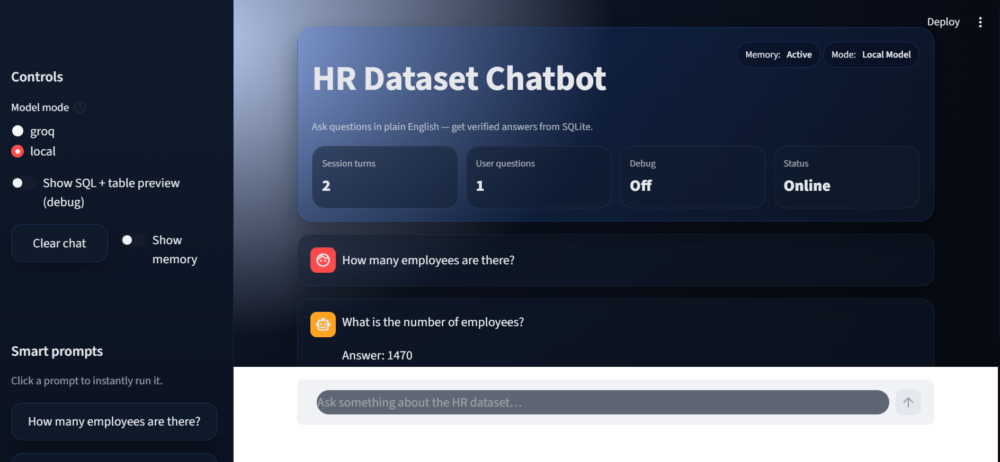
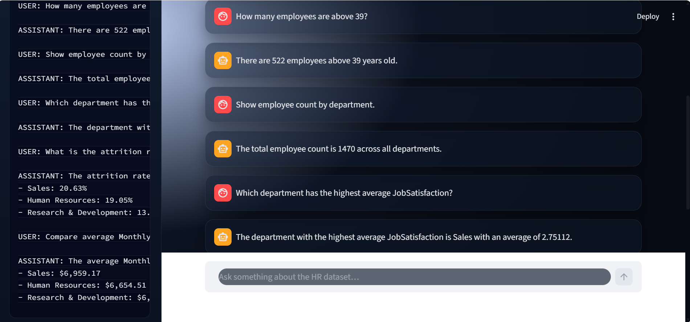
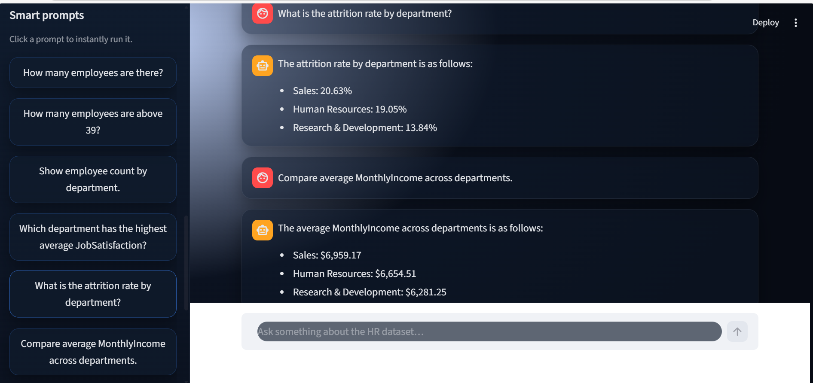
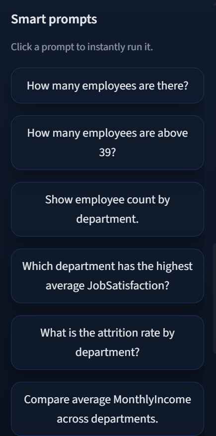
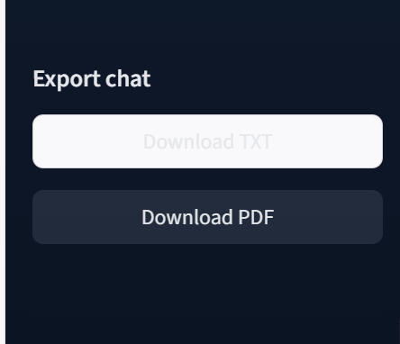
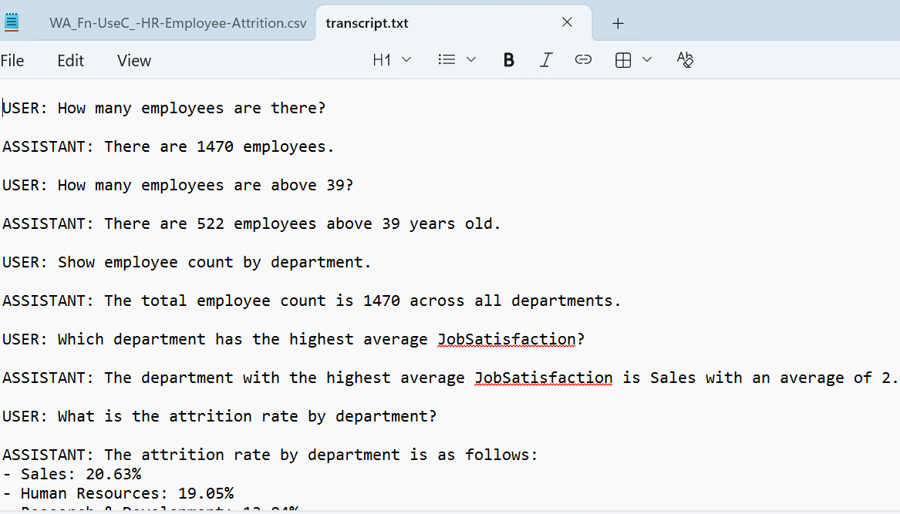
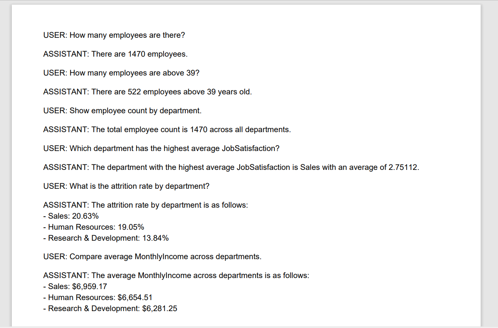

# HR Dataset Chatbot

A Text-to-SQL Conversational Analytics System

---

## Overview

This project implements an HR analytics chatbot that allows users to query an employee dataset using plain English.  
Instead of manually writing SQL, users can ask questions such as employee counts, attrition rates, salary comparisons, or satisfaction metrics.

The system translates natural language questions into SQLite SQL queries, executes them on a local database, and returns concise, human-readable answers.

The chatbot supports:
- Cloud inference (Groq API) for speed and accuracy  
- Local inference (Hugging Face models) for offline demonstration  
- Session-based memory to support follow-up questions  

---

## Key Features

- Natural language querying over structured HR data  
- Automatic Text-to-SQL generation  
- SQLite-backed analytics (no external database required)  
- Session memory for conversational context  
- Dual inference modes: Groq API and Local LLM  
- Debug mode to inspect generated SQL and query results  
- Export conversation history as TXT or PDF  
- Clean, modular, production-style code structure  

---

## Architecture

The HR Dataset Chatbot follows a modular Text-to-SQL architecture with session-based memory.  
User questions are translated into SQL queries, executed on a local SQLite database, and the results are summarized in natural language using a Large Language Model (LLM).

The system supports two inference modes:
- Groq API (fast, cloud-based)  
- Local Hugging Face model (offline fallback)  

### High-Level Flow

1. User submits a natural language question via the Streamlit UI  
2. Recent conversation memory is appended for context  
3. An LLM generates a valid SQLite query based on the schema  
4. The query is executed against the local HR database  
5. Results are summarized into a concise answer  
6. The interaction is stored in session memory  

### Architecture Diagram 
```text
User
  |
  v
Streamlit UI
  |
  v
Chat Engine
  |
  +--> LLM (Groq API / Local Hugging Face Model)
  |        |
  |        +--> SQL generation
  |
  v
SQL Engine (SQLite)
  |
  v
Query Results (DataFrame)
  |
  v
LLM (Answer summarization)
  |
  v
User Response
```
## Project Structure
```text
hr-llm-chatbot/
│
├── app/
│   └── streamlit_app.py        # Streamlit UI
│
├── data/
│   ├── raw/
│   │   └── WA_Fn-UseC_-HR-Employee-Attrition.csv
│   └── processed/
│       └── sentiment_sample.csv
│
├── db/
│   └── hr.db                   # SQLite database
│
├── src/
│   ├── chat_engine.py          # Main orchestration logic
│   ├── sql_engine.py           # SQL execution layer
│   ├── llm_clients.py          # Groq & local LLM routing
│   ├── config.py               # Configuration and env loading
│   ├── ingest.py               # Dataset ingestion
│   ├── sentiment.py            # Sentiment analysis module
│   └── __init__.py
│
├── .gitignore
├── environment.yml
├── requirements.txt
└── README.md
```

## Dataset

The project uses the IBM HR Employee Attrition dataset, containing employee-level attributes such as:
- Age, Department, Job Role  
- Monthly Income, Job Satisfaction  
- Attrition status  
- Years at company, Overtime, Education, and more  

The dataset is ingested once and stored in a local SQLite database for fast querying.

---

## Environment Configuration

Create a `.env` file in the project root:

```env
MODEL_MODE=groq
GROQ_API_KEY=your_api_key_here
GROQ_MODEL=llama-3.1-8b-instant
LOCAL_MODEL_ID=google/gemma-2b-it
```
## Running the Application
streamlit run app/streamlit_app.py

## Screenshots

### Query Answered Using Local Model
Query answered using the local inference mode, demonstrating offline Text-to-SQL capability and on-device reasoning.



### Query Answered Using Groq API
Query answered using the Groq cloud API, providing fast and accurate Text-to-SQL generation with low latency.





### Suggested Prompts
Suggested prompts panel enabling users to quickly run example analytical queries and explore the dataset without manual input.



### Export Conversation (TXT / PDF)
Conversation export feature allowing users to download the full chat history in TXT or PDF format for reporting and documentation.






